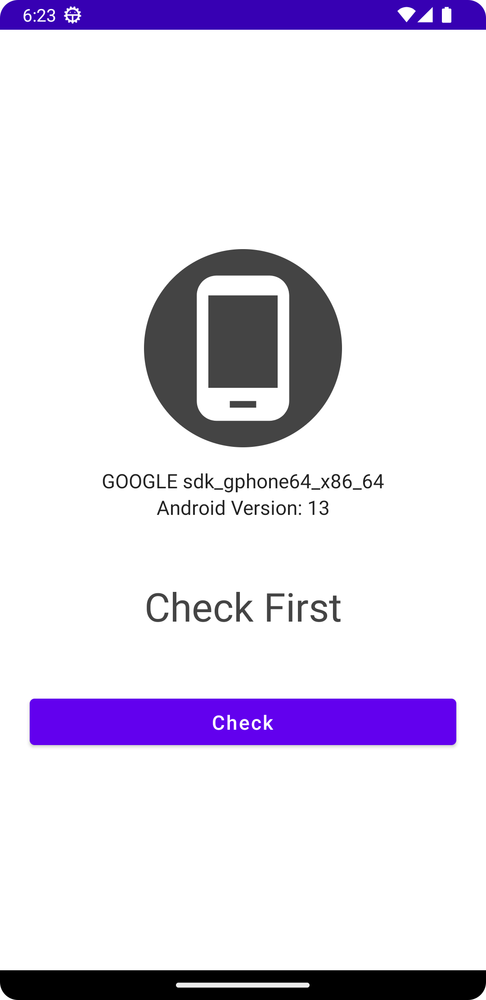
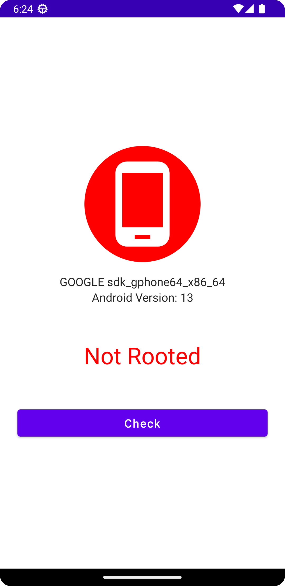

# RootChecker
A simple application to check whether device is rooted or not.  

Basic idea of application is taken from https://github.com/tiagorlampert/RootChecker.git  
I just converted application in Jetpack-Compose  

<h1>ScreenShots</h1>

    
  
  <h1>Contact</h1>
  <a href="mailto:amity1401@gmail.com">amity1401@gmail.com</a> 
  
  
 If it doesn't work then please let me know.
